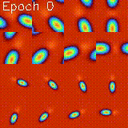
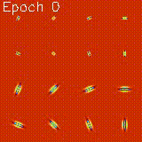
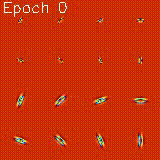

 Welcome to Parametric Scattering Networks
==============================
[](https://paperswithcode.com/sota/small-data-image-classification-on-cifar-10-2?p=parametric-scattering-networks)
                                                              [](https://paperswithcode.com/sota/small-data-image-classification-on-cifar-10?p=parametric-scattering-networks)
                                                              
This repository contains the code for [Parameteric Scattering Networks](https://arxiv.org/abs/2107.09539). It also contains code to run and test new hybrid architectures for the small sample regime. 

NOTE
----------------
Kymatio updates have since broken the Parametric Scattering Network implementation used in this repo. While we intend to fix this, this tutorial notebook [here](https://colab.research.google.com/drive/1maZ82CuNShC7nwuJYOe460YcbU-n7Yzt?usp=sharing) contains an updated (as of April 2024) implementation of the Parametric Scattering Network, complete with documentation.

Citation
----------------
If you found our work useful, please cite our CVPR2022 paper

```bibtex
@InProceedings{Gauthier_2022_CVPR,
    author    = {Gauthier, Shanel and Th\'erien, Benjamin and Als\`ene-Racicot, Laurent and Chaudhary, Muawiz and Rish, Irina and Belilovsky, Eugene and Eickenberg, Michael and Wolf, Guy},
    title     = {Parametric Scattering Networks},
    booktitle = {Proceedings of the IEEE/CVF Conference on Computer Vision and Pattern Recognition (CVPR)},
    month     = {June},
    year      = {2022},
    pages     = {5749-5758}
}
```

100 Sample CIFAR-10 Challenge
----------------


When combined in with a wide residual network, our learnable scattering networks define the SOTA for 100 sample CIFAR-10 accuracy. We would like to invite any and all researchers who believe they can improve on our results to try and do so using this repository. To obtain comparable results when subsampling from such a large training set, it is important to use the same seeds and to control for deterministic computations. Our repository does both. By running the ```competition/cifar-10_100sample.py``` script, users can generate our state of the art result on CIFAR-10. The results will automatically be logged to mlflow. By modifying the same script and corresponding code under ```parametricSN/```, users can insert their own architectures.

```
cd /path/to/repository/ParametericScatteringNetworks
pyton competition/tf_scatt_wrn_100sample_cifar10.py
```

<!--- 

[Screen Shot 2021-08-09 at 9 49 14 AM](https://user-images.githubusercontent.com/23482039/128716927-e73247a1-5423-4408-bea5-06fecfbd8396.png) 

---> 
Explore The Mortlet Wavelet Filters we Optimize
------------

<p align="center">
(left) Filters in the fourier domain (middle) Real part of the filters (right) Imaginary part of the filters
 </p>
 <p align="center">
                                  
</p>


The above gifs visually depict the optimizaiton of our scattering network's morlet wavelet filters. Each frame corresponds to one batch gradient descent step using a 1000 sample subset of CIFAR-10 for training. For instance, the 30th frame corresponds to the positions of the filters after 30 steps of batch gradient descent. The filters were initialized from a tight-frame.


You can use the following notebook to explore the parameters used to create the filters.
[](https://github.com/sgaut023/kymatio_mod/blob/master/parametricSN/notebooks/FilterParamsEffectColab.ipynb)

Get Setup
------------

Start by cloning the repository
```
git clone https://github.com/btherien/ParametricScatteringNetworks
```

PIP
-----

```
python3 -m venv /path/to/virtual/environments/parametricSN
source /path/to/virtual/environments/parametricSN/bin/activate
pip install /path/to/ParametricScattering/Networks/requirments/pip_reqs.txt
```


Conda
------
Prerequisites
- Anaconda/Miniconda 

To create the `parametricSN` conda environment, enter the following in the command prompt: 
```
conda env create -f parametricSN/environment.yml
```
To active the `parametricSN` conda environment, enter the following: 
```
conda activate parametricSN
```
Datasets
------------
Our empirical evaluations are based on three image datasets, illustrated in the Figure below. We subsample each dataset at various sample sizes in order to showcase the performance of scattering-based architectures in the small data regime. CIFAR-10 and [KTH-TIPS2](https://www.csc.kth.se/cvap/databases/kth-tips/credits.html) are natural image and texture recognition datasets (correspondingly). They are often used as general-purpose benchmarks in similar image analysis settings. [COVIDx CRX-2](https://www.kaggle.com/andyczhao/covidx-cxr2) is a dataset of X-ray scans for COVID-19 diagnosis; its use here demonstrates the viability of our parametric scattering approach in practice, e.g., in medical imaging applications.

<p align="center">
  
</p>

Experiments
------------
All experiments from [Parameteric Scattering Networks](https://arxiv.org/abs/2107.09539) can be reproduced using the scripts in the experiments folder. For instance, the following command will run our Scattering+LinearLayer 100 sample CIFAR-10 experiment. 
```
python parametricSN/experiments/cifar_experiments/ll/ll_100sample_cifar10_experiment.py
```
Running experiments on the [KTH-TIPS2](https://www.csc.kth.se/cvap/databases/kth-tips/credits.html) dataset can be done similarly.
```
python parametricSN/experiments/kth_experiments/ll_kth_sample-experiment.py
```
For [COVIDx CRX-2](https://www.kaggle.com/andyczhao/covidx-cxr2)
```
python parametricSN/experiments/xray_experiments/ll/ll_100sample_xray_experiment.py
```
All the results and plots are automatically saved in MLflow. 

Evaluating Robustness to Deformation
--------------
In [previous work](https://www.di.ens.fr/~mallat/papiers/ScatCPAM.pdf)(Section 2.5), the scattering transform has been shown to be robust to small deformations. We have created an experiment to test the empirical validity of this theorem for trained parameteric scattering networks (fixed or learnable). To compare different models, the user must first train them on the dataset of interest (using our scripts under the experiments folder) with the 'model' 'save' variable set to True. Once different models have been trained, comparing their deformantion stability is simple: just provide the paths to the desired model's mlflow artifacts (E.G. ```"/ParametricScatteringNetworks/mlruns/1/03f1f015288f47dc81d0529b23c25bf1/artifacts/model"```) to our deformantion script. In this way, multiple different models can be compared:

```
python parametricSN/evaluate_deformed_representation.py <artifact_path1> <artifact_path2>
```

The resulting figures will automatically be logged to mlflow. Below is an example of the script's output for 4 models using the rotation deformation. The figures show, in order, (x) the image before the deformation, (x_tilde) the image after the deformation (visualized at its most deformed point), and the plot of the defomation strength (x-axis) and the distance betweren s(x) and s(x_tilde) normalized by s(x) where s is the scattering transform (y-axis). The horizontal lines are a baseline that indicate the average distance for 50 images between s(x) and s(random_im) normalized by s(x) where random_im is a randomly chosen image from the dataset.
 
 
<p align="center">
                                  
</p>


Results
------------
We consider hybrid architectures somewhat inspired by [Edouard Oyallon et al.](https://arxiv.org/abs/1809.06367), where scattering is combined with a Wide Residual Network (WRN), and another simpler one, denoted LL, where scattering is followed by a linear model. We compare learned parametric scattering networks (LS) to fixed ones (S), for both random (Rand) and tight frame (TF) initializations. We also compare our approach to a fully learned WRN. Our evaluations are based on three image datasets: CIFAR-10, COVIDx CRX-2 and KTH-TIPS2. For CIFAR-10, the training set is augmented with pre-specified autoaugment. The Table below reports the results with J=2. Learnable scattering with tight frame configuration improves performance for all architectures, showing benefits for small sample sizes. Randomly-initialized scattering can reach similar performance to tight frame after optimization.
| Init. | Arch.           | 100 samples             | 500 samples             | 1000 samples            | All                                           |
|-------|-----------------|-------------------------|-------------------------|-------------------------|-----------------------------------------------|
| TF    | LS+LL           | 37.84±0.57              | 52.68±0.31              | 57.43±0.17              | 69.57±0.1                                     |
| TF    | S +LL           | 36.01±0.55              | 48.12±0.25              | 53.25± 0.24             | 65.58±0.04                                    |
| Rand  | LS+LL           | 34.81±0.6               | 49.6±0.39               | 55.72±0.39              | 69.39±0.41                                    |
| Rand  | S +LL           | 29.77±0.47              | 41.85±.41               | 46.3±0.37               | 57.72±0.1                                     |
| TF    | LS+WRN          | 43.60±0.87              | 63.13±0.29             | 70.14±0.26              | 93.61±0.12                                    |
| TF    | S +WRN          | 43.16±0.78              | 61.66±0.32              | 68.16±0.27              | 92.27±0.05                                    |
| Rand  | LS+WRN          | 41.42±0.65              | 59.84±0.40              | 67.4±0.28               | 93.36±0.19                                    |
| Rand  | S +WRN          | 32.08±0.46              | 46.84±0.21              | 52.76±0.33              | 85.35±1.06                                    |
|       | WRN             | 38.78±0.72              | 62.97± 0.41             | 71.37±0.31              | [95.7](https://arxiv.org/abs/1809.06367)

Table below reports our evaluation on [COVIDx CRX-2](https://www.kaggle.com/andyczhao/covidx-cxr2)  and [KTH-TIPS2](https://www.csc.kth.se/cvap/databases/kth-tips/credits.html) using J=3. For COVIDx CRX-2, we use the same evaluation protocol as CIFAR-10.  We observe that the WRN alone performs worse than the other architectures, demonstrating the effectiveness of the scattering prior in the small data regime. For KTH-TIPS2, following the [standard protocol](https://openaccess.thecvf.com/content_ICCV_2017/papers/Song_Locally-Transferred_Fisher_Vectors_ICCV_2017_paper.pdf), we train the model on one of the four physical samples of 11 different materials (1188 images), while the rest are used for testing. Out of all the WRN hybrid models, the random learnable model achieves the highest accuracy and is the only one to improve over its linear counterpart. 

| Init. | Arch.           |XRAY-100 samples         | XRAY-500 samples        | XRAY-1000 samples      | KTH                     |
|-------|-----------------|-------------------------|-------------------------|-------------------------|-------------------------|
| TF    | LS+LL           | 74.80±1.65              | 83.10±0.84              | 84.58±0.79              | 66.83±0.94              |
| TF    | S +LL           | 75.48±1.77              | 83.58±0.91              | 86.18±0.49              | 63.91±0.57              |
| Rand  | LS+LL           | 73.15±1.35              | 82.33±1.1               | 84.73±0.59              | 65.98±0.73              |
| Rand  | S +LL           | 74.25±0.86              | 82.53±0.76              | 85.43±0.51              | 60.42±0.34              |
| TF    | LS+WRN          | 78.1±1.62               | 86.15±0.63              | 89.65±0.42              | 66.46±1.09              |
| TF    | S +WRN          | 76.23±2                 | 86.5±0.66               | 89.13±0.36              | 63.77±0.59              |
| Rand  | LS+WRN          | 74.86±1.22              | 84.15±0.79              | 87.63±0.55              | 67.35±0.51              |
| Rand  | S +WRN          | 75.4±1.03               | 83.75±0.58              | 87.48±0.61              | 65.05±0.38              |
|       | WRN             | 69.15±1.13              | 80.04±2.41              | 87.81±1.37              | $51.24±1.37             |


Project Organization
------------

    ├── conf                    <- Configuration folder
    ├── data                    <- Contains datasets - to create the different datasets please see section Datasets
    ├── experiments        
    │   ├── cifar_experiments   <- All scripts to reproduce cifar experiments.
    |       ├── cnn             <- Scripts tp run all experiments of hybrid sacttering + cnn.
    |       ├── ll              <- Scripts tp run all experiments of hybrid sacttering + linear layer.
    |       └── onlycnn         <- Scripts tp run all experiments of cnn without scattering priors.
    │   ├── kth_experiments     <- All scripts to reproduce KTH-TPIS2 experiments.
    │   └── xray_experiments    <- All scripts to reproduce Covidx CRX-2 experiments.
    |       ├── cnn             <- Scripts tp run all experiments of hybrid sacttering + cnn.
    |       ├── ll              <- Scripts tp run all experiments of hybrid sacttering + linear layer.
    |       └── onlycnn         <- Scripts tp run all experiments of cnn without scattering priors.
    ├── kymatio                 <- Folder copied from: https://github.com/kymatio/kymatio.
    ├── parametricSN 
    │   ├── data_loading        <- Wrapper for subsampling the cifar-10, KTH-TIPS2 and Covidx CRX-2 based on given input.
    │   ├── models              <- Contains all the  pytorch NN.modules for this project.
    │   └── notebooks           <- Jupyter notebooks.
    │   └── training            <- Contains train and test functions.
    │   └── utils               <- Helpers Functions.
    │   └── main.py             <- Source code.
    │   └── environment.yml     <- The conda environment file for reproducing the analysis environment.
    ├── mlruns                  <- All the experiment results are automatically saved in this folder. 
    
    


